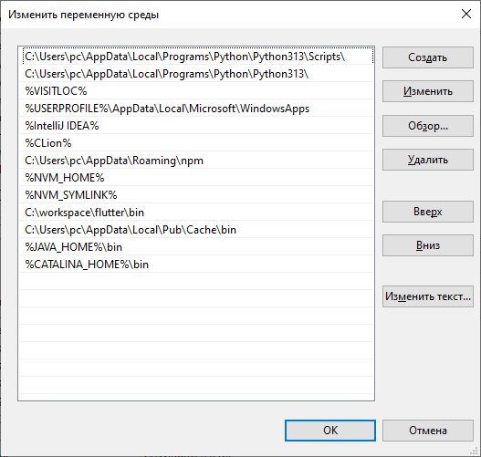
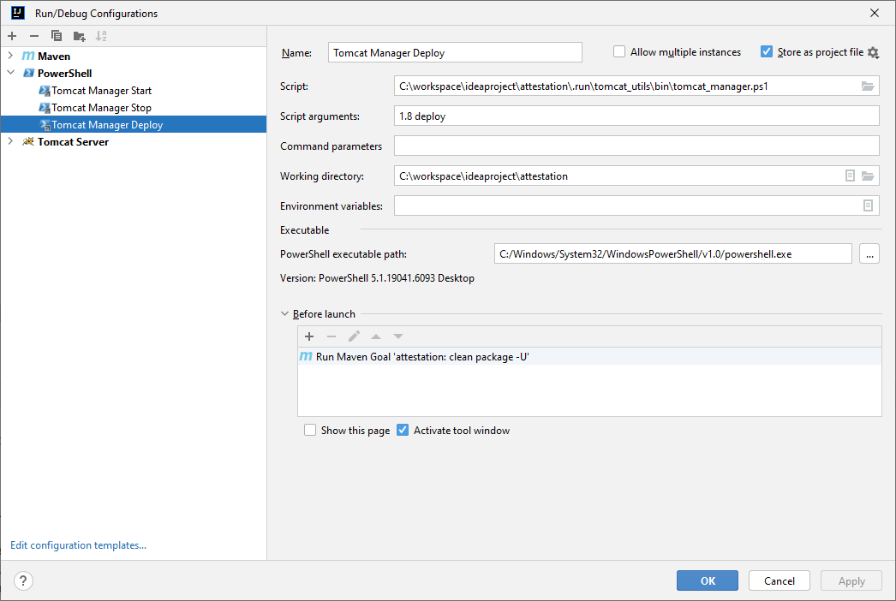
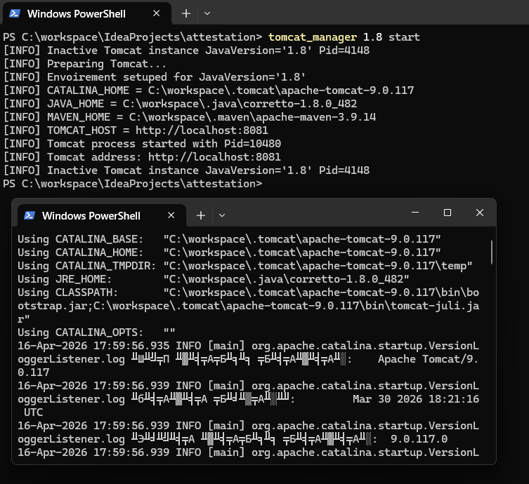

# Tomcat Utils v1.1.0

> Powershell-скрипты для удобства развёртывания Java приложений 
> с несколькими экземплярами Tomcat 

## Выдача разрешений
> Если система блокирует исполнение `.ps1` скриптов выполните комманду:
```ps1
Set-ExecutionPolicy -ExecutionPolicy RemoteSigned -Scope CurrentUser
```

Она предоставит разрешение на исполнение всем `.ps1`-скриптам.

## Настройка переменных окружения
> Директорию `tomcat_utils` можно разместить где-нибудь по ближе к корню диска, 
> а директорию `...\tomcat_utils\bin` добавить в `$env:PATH`

> Добавьте в `$env:PATH` строки `%JAVA_HOME%\bin` и `%CATALINA_HOME%\bin` - 
> это позволит гибко переключаться между версиями

> Создайне строку `$env:MAVEN_HOME` ведущую до maven, 
> например `"C:\Program Files\JetBrains\IntelliJ IDEA 2023.1.2\plugins\maven\lib\maven3"`



> Уберите глобальные (системные или Machine) `$JAVA_HOME` и `$CATALINA_HOME`

> Локальные (пользовательские или User) `$JAVA_HOME` и `$CATALINA_HOME` 
> Tomcat Manager заполняет сам


В противном случае у вас будет путаница и вызов `catalina` 
будет давать разные результаты и часто завершаться ошибкой
```
Error: Could not create the Java Virtual Machine.
Error: A fatal exception has occurred. Program will exit.
```
Однако даже так если вы будете переключать версии знайте - IDEA кеширует PATH 
в момент запуска и изменения окружения не подтянутся корректно

> Поэтому если требуется вызвать `catalina` - лучше 
откройте `Powershell` отдельно, а не `Terminal` в интерфейсе IDEA

Tomcat Manager в свою очередь не прихотлив к этому 
и использует прямой путь до `catalina.bat` 
который строит сам на основе первого аргумента `-JavaVersion`

## Конфигурирование Tomcat Utils
> Файл `tomcat_utils\tomcat_configs.json` содержит персональные и 
> глобальные настройки для каждого экземпляра Tomcat

> TOMCAT_DIR - Указывает на корневую директорию всех экземпляров Tomcat. 
> *Желательно чтобы все экземпляры Tomcat были расположены там*

> JAVA_DIR - Указывает на корневую директорию всех экземпляров Java (JDK). 
> *Желательно чтобы все экземпляры Java были расположены там*

> MANAGER_USERS - список пользователей "по умолчанию", 
> которые будут внесены в `apache-tomcat-*\conf\tomcat-users.xml`.
> *Не затронет экземпляры Tomcat отсутствующие в `tomcat_utils\tomcat_configs.json`*

> JAVA_VERSIONS - Экземпляры Tomcat управляемые Tomcat Utils. 
>- JAVA_HOME - полный путь до нужного экземпляра Java (JDK)
>- TOMCAT_HOME - полный путь до нужного экземпляра Tomcat
>- CONNECTORS - список **уникальных** портов используемые экземпляром Tomcat
>- SHUTDOWN_PORT - **уникальный** порт используемый для передачи команды `SHUTDOWN`

## Tomcat Init
> Скрипт проверяющий и применяющий все конфигурации из `tomcat_utils\tomcat_configs.json`
> к экземплярам Tomcat

> `Silent` - опциональный флаг, запуск с которым будет без вывода `[INFO]` сообщений

> Каждый раз когда меняется конфигурация в `tomcat_utils\tomcat_init.ps1` -
> нужно вызывать `tomcat_utils\tomcat_init.ps1`
>
> Каждый раз когда устанавливается, удаляется или редактируется сам экземпляр Tomcat -
> нужно вызывать `tomcat_utils\tomcat_init.ps1`

## Tomcat Install
> Скрипт выполняющий установку всех jar-либ из директории проекта `src\main\webapp\WEB-INF\lib`.
> Возвращает в консоль XML-код - который надо вставить в `pom.xml` файл проекта.

> `GroupId` - текст в формате `you.group.id`, который будет использоваться в качестве `-DgroupId` аргумента при установки ВСЕХ либ из директории `src\main\webapp\WEB-INF\lib`.

> `Silent` - опциональный флаг, запуск с которым будет без вывода `[INFO]` сообщений, mvn логов и XML-вставки для `pom.xml`

## Tomcat Wrapper
> Скрипт-обёртка оставляющий окно открытым в случае внезапного 
> завершения работы экземпляра Tomcat

## Tomcat Manager
> Основной скрипт для управления экземплярами Tomcat.
> 
> **ВАЖНО**: Если экземпляр Tomcat был запущен без Tomcat Manager, 
> то он может занимать один или несколько требуемых поров - тем самым мешая запуску.
> *Tomcat Manager не может остановить работу такого экземпляра*

> `JavaVersion` - обязательный параметр, определяющий 
> какой экземпляр Tomcat будет использоваться
> 
> **ВАЖНО**: При каждом запуске устанавливает значения переменных окружения на те,
> что указаны в `tomcat_utils\tomcat_configs.json` для конкретной JavaVersion

> `Mode` - обязательный параметр, определяющий 
> какое действие будет выполнено с экземпляром Tomcat
> - deploy 
>   - выполняет копирование `war` файла из локальной `target` директории 
> в директорию `apache-tomcat-*\webapps` экземпляра Tomcat
>   - завершает работу активного экземпляра Tomcat (если он был запущен Tomcat Manager)
>   - запускает экземпляр Tomcat
> - start
>   - завершает работу активного экземпляра Tomcat (если он был запущен Tomcat Manager)
>   - запускает экземпляр Tomcat
> - stop
>   - завершает работу активного экземпляра Tomcat (если он был запущен Tomcat Manager)

> `Silent` - опциональный флаг, запуск с которым будет без вывода `[INFO]` сообщений

## Пример конфигурации IDEA:


## Демонстрация
